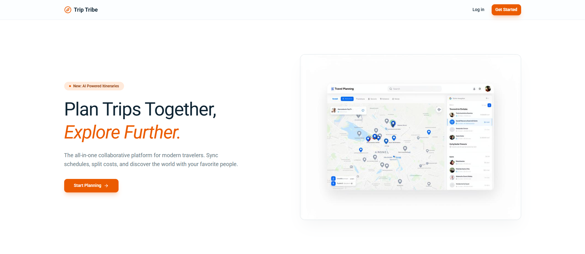
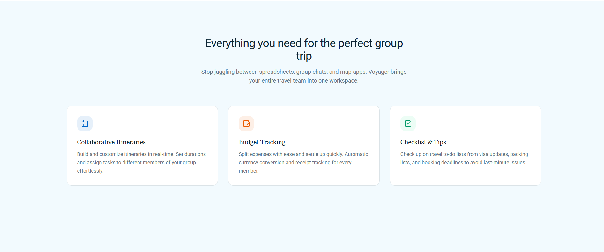
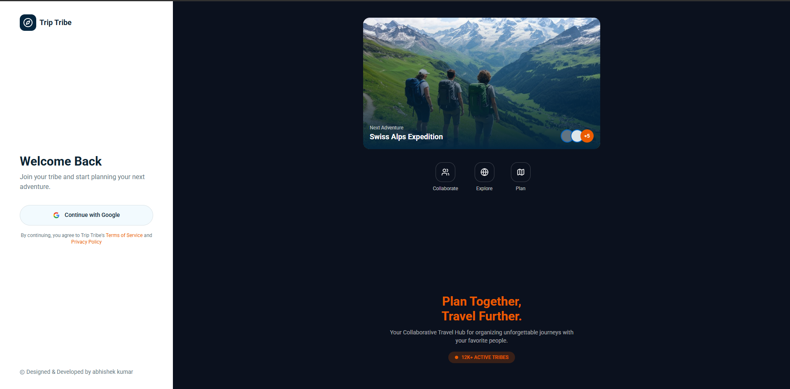
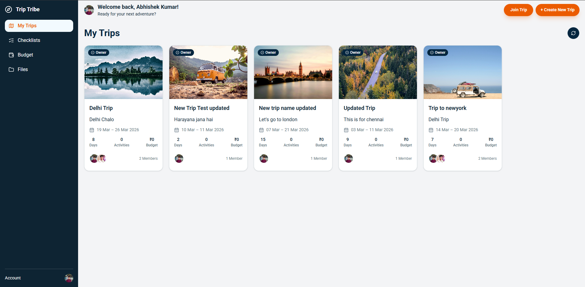
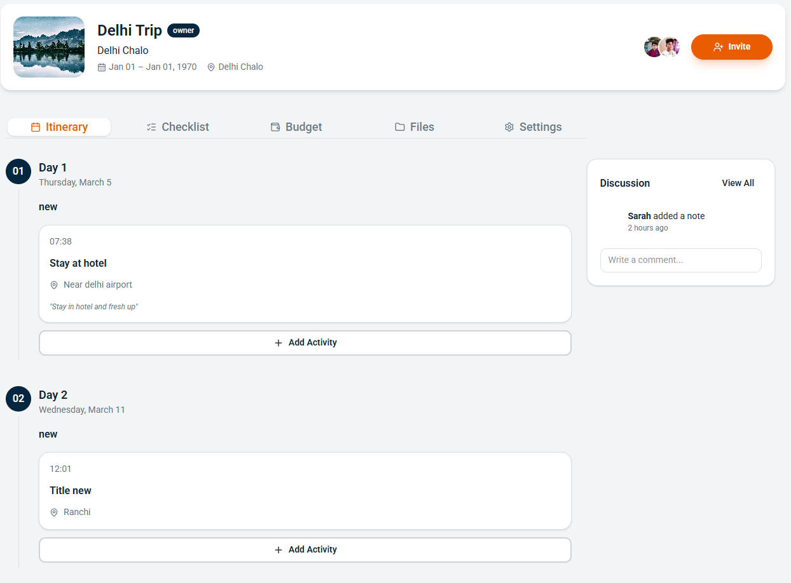
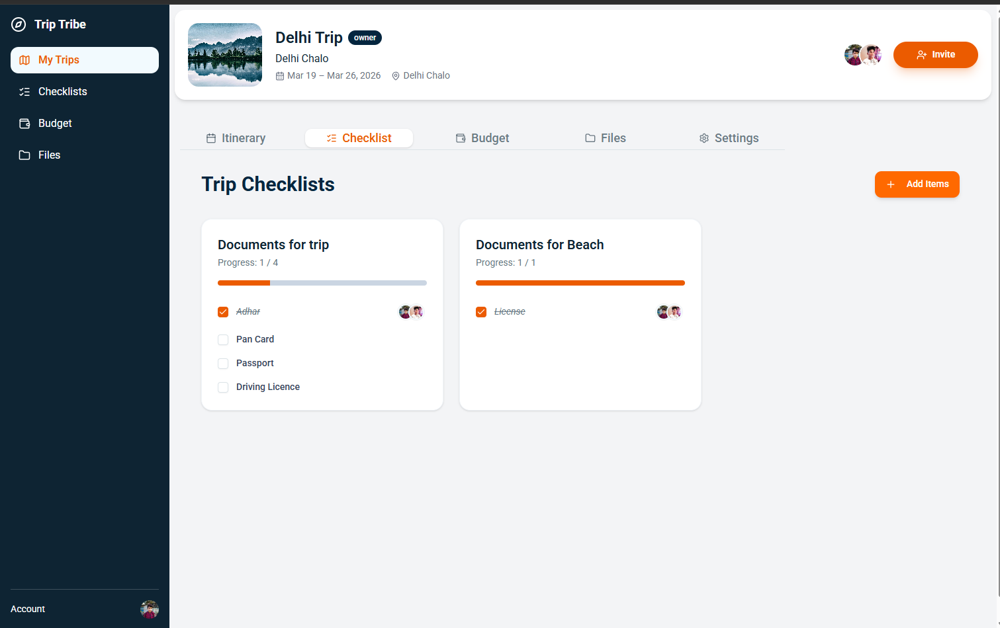
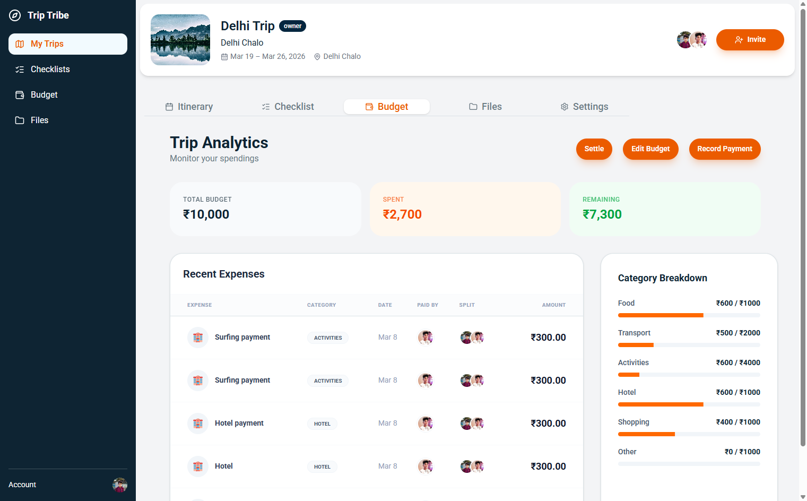
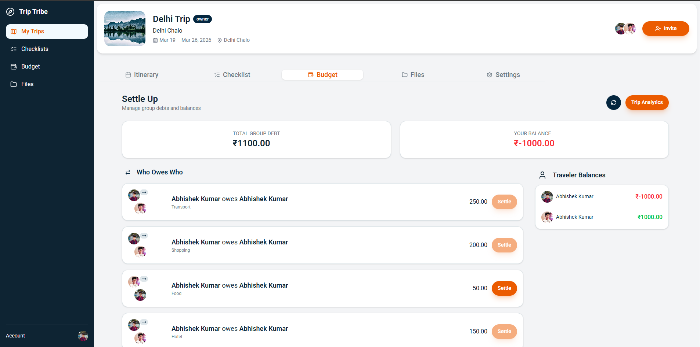
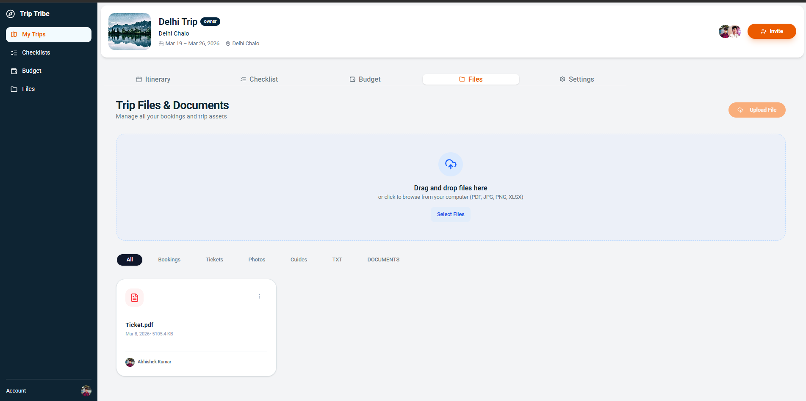
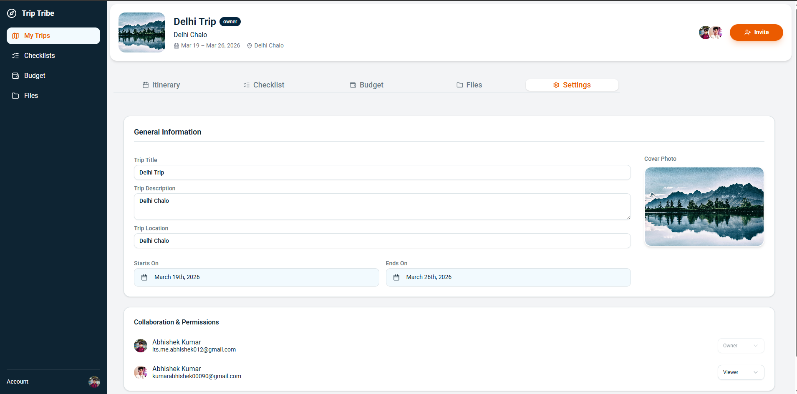

# ✈️ TripTribe: Collaborative Trip Planning Made Simple

**Live Demo:** [https://trip-tribe-frontend-steel.vercel.app/](https://trip-tribe-frontend-steel.vercel.app)

---

## 📖 Overview
**TripTribe** is a modern, full-stack collaborative platform designed to take the friction out of group travel. Whether you are planning a weekend getaway or a long-distance journey, TripTribe brings all your logistics—itinerary, budgeting, and checklists—into a single, real-time synchronized dashboard.

### The Problem It Solves
Planning trips with a group often involves fragmented spreadsheets and messy chat threads. 
* **Fragmentation:** Consolidates maps, notes, and expense tracking into one place.
* **Real-time Sync:** Ensures every member of the "tribe" sees plan changes instantly via WebSockets.
* **Expense Complexity:** Automated split calculations handle the math, reducing social friction regarding money.

---

## ✨ Key Features

### 🗺️ Dynamic Itinerary 
* **Daily Timeline:** Organize activities by day with specific time slots, locations, and notes.
* **Visual Progress:** A clean vertical timeline UI to track your journey as it happens.

### 💰 Smart Budgeting & Expenses
* **Dashboard Analytics:** High-level overview of total budget vs. actual spending with utilization percentages.
* **Category Breakdown:** Track spending across Food, Transport, Hotel, Shopping, and more.
* **Group Splits:** Add expenses and split them equally or selectively among participants.

### 📋 Collaborative Checklists
* **Categorized Tasks:** Group items by "Essentials," "Documents," or "Gear".
* **Shared Progress:** See who completed which item with real-time avatar updates.

### 💬 Tribe Interaction
* **Discussion Board:** Leave notes and comments on specific activities or trip updates.
* **Member Management:** Invite friends to your trip via unique invite codes and manage roles like "Owner" or "Member".

---
## 📸 App Screenshots

### Landing Page



### Sign in Page

### Trips View

### Itinerary View

### checklists View

### BudgetDashboard View

### Debt settlement View

### Files View

### Settings View


---

## 🛠️ Tech Stack

### Frontend
* **Core:** React 19 (Vite) & TypeScript.
* **State Management:** Zustand (with persistent storage).
* **UI & Styling:** Tailwind CSS, Shadcn UI, Framer Motion.
* **Authentication:** Clerk Auth.
* **Real-time:** Socket.io-client.

### Backend (Overview)
* **Runtime:** Node.js & Express.
* **Database:** MongoDB with Mongoose ODM.
* **Real-time:** Socket.io for live synchronization.

---

## 🚀 Getting Started

### Prerequisites
* Node.js (v18 or higher)
* npm, yarn, or pnpm
* A Clerk account for API keys

### Installation

1. **Clone the this(frontend) repository**
   ```bash
   git clone https://github.com/abhishek-2k23/TripTribe-frontend
   cd triptribe-frontend
   npm install

2. **Clone the backend repository**
   ```bash
   git clone https://github.com/abhishek-2k23/TripTribe-backend
   cd triptribe-backend
   npm install